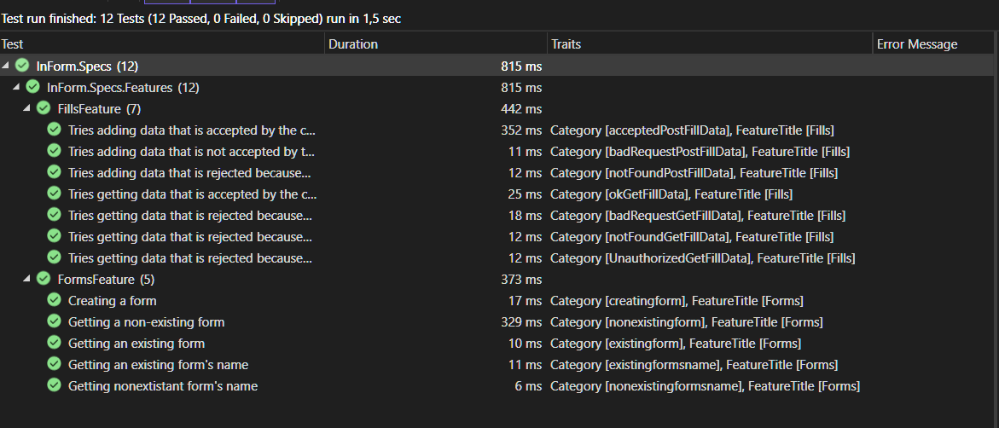

# Feladatkiírás:
BDD tesztek készítése (Cucumber, Specflow...)

# Feladat:
A projekthez BDD teszteket készíteni Specflow használatával.

### Hibajegy: 
https://github.com/BME-MIT-IET/iet-hf-2024-kszi/issues/13#issue-2297652808

## Elvégzett munka

A tesztek xUnit környezetben futnak.   
 A BDD tesztek megírásához Specflow-t használtam.  
 A teszteket egy külön projektbe helyeztem ezt Inform.Specs alatt található
 Teszteket készítettem a projektben található REST API endpointokhoz tartozó függvényekhez
 amelyek:   
 - FillsController
    - AddFillData
    - GetFillData
 - FormsController
    - GetForm
    - GetFormName
    - CreateForm  
      
Ezekhez a scenariokat Gherkinben írtam meg, ezek a Fills.feature és a Forms.feature fájlokban találhatóak.  
Ezek a hozzájuk tartozó StepDefinitions osztálybeli függvényeket hívják.  
A tesztelni kívánt FillsController és FormsController osztályok felparaméterezéséhez Moq-ot és az azon alapuló Moq wrappert az EntityFrameworkCoreMock.Moq-ot használtam.   

A pédányosított controller osztályok a saját service-üket használják viszont rendes adatbázis helyett egy mockolt dbcontext-et használnak ami lehetővé teszi a tesztadatok memóriában való tárolását.

A tesztek eredményei:

  
## Tapasztalatok

A tesztek írása során és fejlesztés során Microsoft Visual Studio-t használtam, ehhez szereztem be egy Specflow-s extension-t ami viszont nem "szerette" a .net 8-as projektet mivel nem találta meg egyik tesztszenárióhoz kapcsolódó StepDefinitions-t sem. A  StepDefinition generálás se ment. Keresgélés után találtam, hogy a Visual Studio Marketplace-en levő verzió nem a legfrissebb és még nincs benne .net 8 support.Ebben az issue-ban linkelt release feltelepítése megoldotta a problémát : (https://github.com/SpecFlowOSS/SpecFlow.VS/issues/145).  
  
Mivel még nem készítettem ilyen teszteket a fenti probléma megoldása után is voltak kisebb elakadásaim.
 