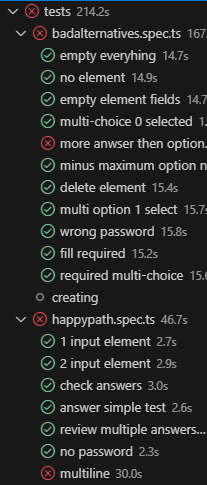

# Feladatkiírás:
UI tesztek készítése (Selenium, Tosca, Appium...)

# Feladat:
Felhasználói feladat tesztelése, playwrigth microsofots npm package felhasználásával

### Hibajegy: 
https://github.com/BME-MIT-IET/iet-hf-2024-kszi/issues/10[#10]

# Tesztek
A UI tesztelésének menetét két részletre bontottam
- happy path tesztek
- bad alternatives tesztek

# Happy path tesztek:
A happy path tesztekben azt alapfunkcionalitást tesztelem, azon esetekre fókuszáltam, amelyek ideális esetben fordulnak elő.
- ## 1 input element

&nbsp; A teszt megnyitja az weboldalt, létrehot benne egy új tesztet. A létrejött tesztnek ezután kitölti a mezőit, ad egy választ a feltett kérdésre.

**Teszt akkor sikeres, ha a lépéssorozat sikeresen lefut és a végén megjelenik a `Submit` kattintható gomb.**

- ## 2 input element

&nbsp; A teszt létrehoz egy tesztet az előzőhöz nagyon hasonlóan, azonban 2 különböző elementtel. Végül pedig submiteli azokat.

**Teszt akkor sikeres, ha a lépéssorozat sikeresen lefut és a végén megjelenik a `Submit` kattintható gomb.**

- ## check answers

&nbsp; A teszt létrehoz egy tesztet azt kitölti és leadja a válaszát. Ezután megtekinti a kvíz válaszait ott megtalálható az adott válasz.

**Teszt akkor sikeres, ha a lépéssorozat sikeresen lefut és a végén megjelenik a `response` felirat.**

- ## answer simple test

&nbsp; A teszt létrehoz egy tesztet 1 text elementtel. Ezt az elementet ezekután a főoldalról az open-el megnyitja és ott ad le választ.

**Teszt akkor sikeres, ha a lépéssorozat sikeresen lefut és a végén megjelenik a `Thank you for filling out this form. See results` felirat.**

- ## review multiple answers

&nbsp; A teszt létrehoz egy tesztet majd a tesztet megoldja. Ezután megnyitja ugyanazon tesztet a főmenüből és ismét kitölti, végül megnézi a kaptt eredményeket.

**Teszt akkor sikeres, ha a lépéssorozat sikeresen lefut és a végén megjelennek a `response1` és `response2` feliratok.**

- ## no password

&nbsp; A teszt létrehoz egy tesztet jelszó nélkül majd a tesztet megoldja. Végül megoldja és megtekinti az eredményeket.

**Teszt akkor sikeres, ha a lépéssorozat sikeresen lefut és a végén megjelenik a `response` felirat jelszó beírása nélkül.**

- ## multiline

&nbsp; A teszt létrehoz egy tesztet ami multiline, majd megpróbál több soros választ adni.

**Teszt akkor sikeres, ha a lépéssorozat sikeresen lefut és a több sort is sikerül bevinni a mezőbe a `shift + enter` kombinációt alkalmazva.**

# Bad Alternatives tesztek:
Ezen tesztek lényege a hibás működés kiszúrása "edge-case" helyzetek előidézésével.

- ## empty everything

&nbsp; A teszt létrehoz egy tesztet és semmit nem tölt ki majd megpróbálja publikálni.

**Teszt akkor sikeres, ha a lépéssorozat sikeresen lefut és a végén megjelennek a `The form title must be between 4 and 64 characters` és `At least one form element is required` feliratok.**

- ## no element

&nbsp; A teszt létrehoz egy tesztet majd azt kitölti és element létrehozása nélkül próbálja publikálni.

**Teszt akkor sikeres, ha a lépéssorozat sikeresen lefut és a végén megjelenik a `At least one form element is required` felirat.**

- ## empty element fields

&nbsp; A teszt létrehoz egy tesztet majd egy üres elementtel próbálja véglegesen publikálni.

**Teszt akkor sikeres, ha a lépéssorozat sikeresen lefut és a végén megjelenik a `A title is required` felirat.**

- ## multy-choice 0 selected

&nbsp; A teszt létrehoz egy tesztet multi-choice elementtel, majd de a `Maximum selectable` mezőt 0 értéken hagyja.

**Teszt akkor sikeres, ha a lépéssorozat sikeresen lefut és a végén megjelenik a `The minimum of 1 must be selected for maximum` felirat.**

- ## more answer then option

&nbsp; A teszt létrehoz egy tesztet multi-choice elementtel, majd de a `Maximum selectable` mezőt magasabb értékre állítja be mint, ahány válaszlehetőség van értéken.

**Teszt akkor sikeres, ha a lépéssorozat sikeresen lefut és a marad a teszt létrehozási felületen az alkalmazás.**

- ## minus maximum option number

&nbsp; A teszt létrehoz egy tesztet multi-choice elementtel, majd de a `Maximum selectable` mezőt negatív értékre állítja be.

**Teszt akkor sikeres, ha a lépéssorozat sikeresen lefut és a végén megjelenik a `The minimum of 1 must be selected for maximum` felirat.**

- ## delete element

&nbsp; A teszt létrehoz egy tesztet hozzáad 2 új elementet majd törli azokat, ezután megpróbálja azt publikálni.

**Teszt akkor sikeres, ha a lépéssorozat sikeresen lefut és a végén megjelenik a `At least one form element is required` felirat.**

- ## multi option 1 select

&nbsp; A teszt létrehoz egy multi choice tesztet `Maximum selectable` mezőt 1-re állítva, majd annak kitöltésnél megpróbál több választ is megadni.

**Teszt akkor sikeres, ha a lépéssorozat sikeresen lefut és a végén az `opt1` nincs bejelölve.**

- ## wrong password

&nbsp; A teszt létrehoz egy tesztet, azt kitölti majd megpróbálja egy rossz jelszóval megtekinteni a válaszait.

**Teszt akkor sikeres, ha a lépéssorozat sikeresen lefut és a végén megjelenik a `Incorrect password` felirat.**

- ## fill required

&nbsp; A teszt létrehoz egy tesztet egy text elementtel, ahol a `Fill required` mező aktív, majd azt megpróbálja kitöltés nélkül leadni.

**Teszt akkor sikeres, ha a lépéssorozat sikeresen lefut és a végén megjelenik a `This field is required` felirat.**

- ## required multi-choice

&nbsp; A teszt létrehoz egy tesztet egy multi-choice, ahol a `Fill required` mező aktív, majd azt megpróbálja kitöltés nélkül leadni.

**Teszt akkor sikeres, ha a lépéssorozat sikeresen lefut és a végén megjelenik a `This field is required` felirat.**

# Tesztek lefutása

# Tapasztalatok:
A projekt felhasználó felülete csekély nagyságú volt azonban sikerült hibákat találni. Gyakran nehéz volt keresni, hogy mi az, ami még tesztelésre szorul. A UI tesztek nehézségét még abban is éreztem, hogy nehéz karbantartható teszteket íni, ha minimális változás is történik a felületen, akkor tesztek egy nagyobb része irrelevánssá válhat nagypn egyszerűen.