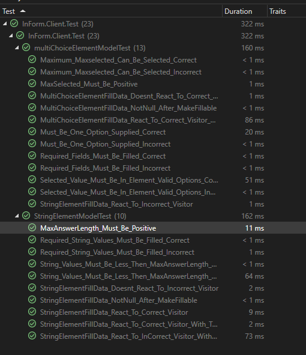
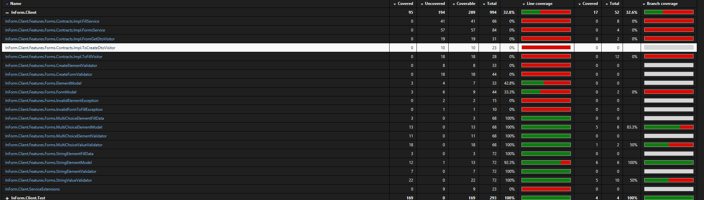
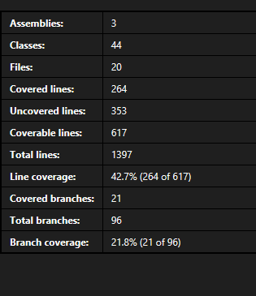

# Feladatkiírás:
Egységtesztek készítése/kiegészítése (xUnit...) + tesztek kódlefedettségének mérése és ez alapján tesztkészlet bővítése (JaCoCo, OpenCover, Coveralls, Codecov.io...)

# Feladat:
A projekt backend részén lévő osztályok illetve azok függvényeinek az egységtesztelése és teszt coverage készítése ezen tesztek alapján.

## Hibajegy:
https://github.com/BME-MIT-IET/iet-hf-2024-kszi/issues/5[#5]

# Elvégzett munka & tapasztalatok:
A teszteléshez az xUnit környezetet használtam.

A backend üzleti logikájának alapvetően két tesztelhető oszálya van a StringElement és a MultiChoiceElement és ezek segédosztályai.

A két osztályban alapvetően hasonló funkciók vannak megvalósítva ez a projekt jellegéből adódótt. A teszteket három típusba lehet sorolni, egyszerő visszatérést tesztelők , más függvények meghívását tesztelők(mockolással), illetve validátorok hibáit néző tesztelők. 

Alapvetően nehéz volt unit teszteket írni a projekthez, mivel nem sok üzleti logikát tartalmaz ez a coveragen is meglátszik, de amik vannak ott adódtak nem teljesen triviális megoldások a mockkal ,illetve a validátor tesztekkel.

## Coverage
A tesztekhez készítettem coverage-t is Fine Code Coverage nevű Visual Studio bővítménnyel, mivel a Vs Community Edition nem tartalmaz coverage tesztelőt.

A coverage alacsony 42%-a annak tudható be, hogy a kódban sok olyan rész van pl ui,http hívások amiket nem unit tesztekkel teszteltünk. 

